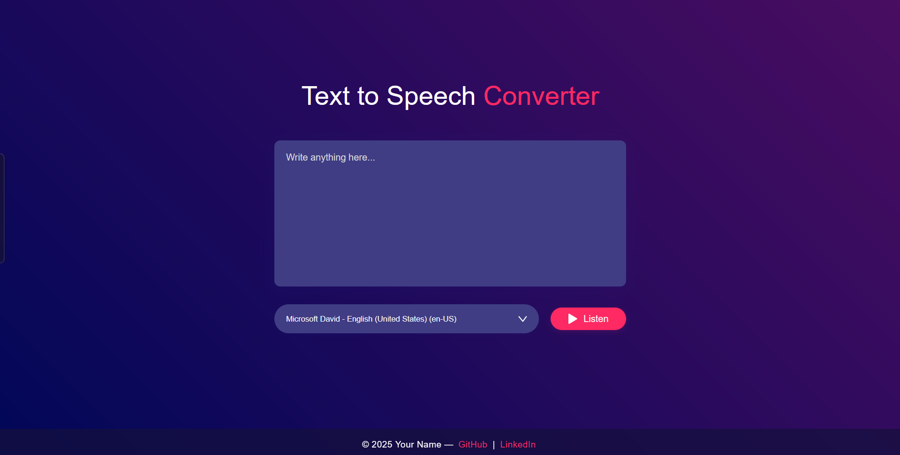

# Text to Voice Converter

A modern, responsive web app that converts text to speech using your browser's built-in voices. Built with HTML, CSS, and JavaScript.

## Features

- Type or paste any text and listen to it spoken aloud
- Choose from all available voices on your device
- Responsive and beautiful UI
- Works on all modern browsers

## Demo



## Live Link

<a href="https://sainath-666.github.io/Text_to_Voice_Converter/" target="_blank" style="display:inline-block;padding:0.6em 1.2em;background:#0078d4;color:#fff;text-decoration:none;border-radius:4px;font-weight:bold;">Try it Live</a>

## Getting Started

1. **Clone the repository**
   ```sh
   git clone https://github.com/sainath-666/text-to-voice-converter.git
   ```
2. **Open the project folder**
3. **Open `index.html` in your browser**

No build steps or dependencies required!

## Usage

- Enter your text in the textarea.
- Select your preferred voice from the dropdown.
- Click the **Listen** button to hear the text spoken aloud.

## Customization

- You can change the color theme in `styles.css`.
- Update the footer in `index.html` with your own name and social links.

## Technologies Used

- HTML5
- CSS3 (Flexbox, Responsive Design)
- JavaScript (Web Speech API)

## Author

**Your Name**  
[GitHub](https://github.com/sainath-666) | [LinkedIn](https://linkedin.com/in/sainath666)

## License

This project is licensed under the MIT License.
